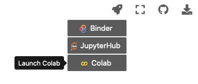
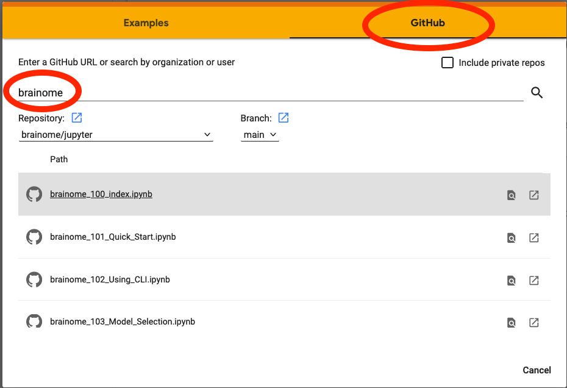

# Running this Tutorial
You can run the notebooks directly in Google Colab, download them to run on your own Jupyter/JupyterLab instance, or simply browse the online HTML version.

## Online HTML Version
This collection of notebooks can be viewed as HTML snapshots at [https://jupyter.brainome.ai](https://jupyter.brainome.ai)

> At any point, you can click on the rocket icon (top right of the page) and select Colab to open the notebook you are viewing in Google Colab.

## Running on Google Colab
_Requires a google account._

Brainome runs on the popular [Google Colab](https://colab.research.google.com)

### How To...
* Open and log into https://colab.research.google.com
* Select File menu | Open notebook
* Select GitHub tab
* Search for _brainome_
* Select _brainome/jupyter_ repository _main_ branch
* Select _brainome_100_index.ipynt_ to run a notebook instance

## Running locally using Docker Desktop
_Requires git and docker desktop_
### How To...
From a command line terminal:

`git clone git@github.com:brainome/jupyter.git`

`cd jupyter`

`docker-compose up --build`